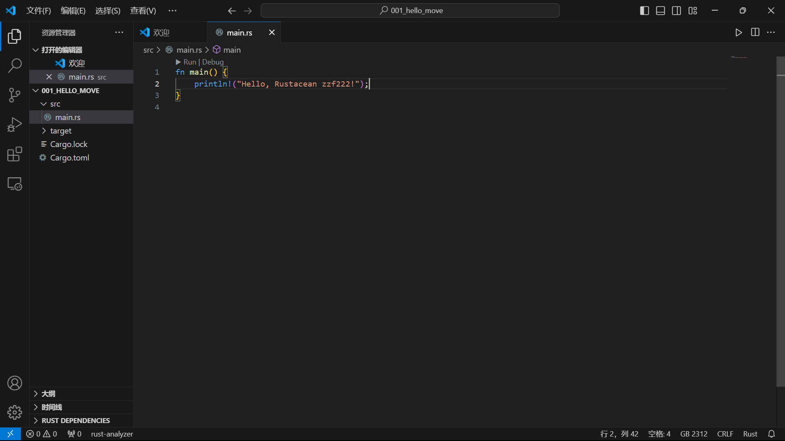
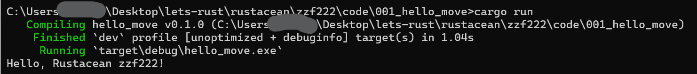

## 基本信息

- Sui钱包地址: `0xdb487655b3fd2c508ffbb8579c3df2151fb8c0abdd812a91738ad3b7a2ef6f2c`
  
  > 首次参与需要完成第一个任务注册好钱包地址才被合并，并且后续学习奖励会打入这个地址,否则视为放弃奖励

- github: [zzf222 · GitHub](https://github.com/zzf222)

## 个人简介

- 工作经验: 0年 / 学生

- 技术栈: `Rust` 
  
  > 重要提示 请认真写自己的简介

- 参与了letsmove，有一些move学习与编程经验，对`Rust` 特别感兴趣

- 联系方式: QQ:1573996155

# 学习笔记

001[安装rust](notes/001_install.md)

## 挑战

-> 文件的路径名不允许中文和空格（部分操作系统不支持）

## `001`  install

- [x] Cargo CLI version:cargo 1.81.0 (2dbb1af80 2024-08-20)

- [x] IDE 截图:

- [x] Hello Rust 截图:
